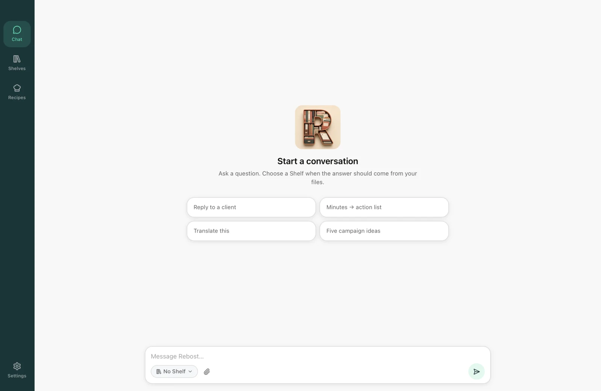
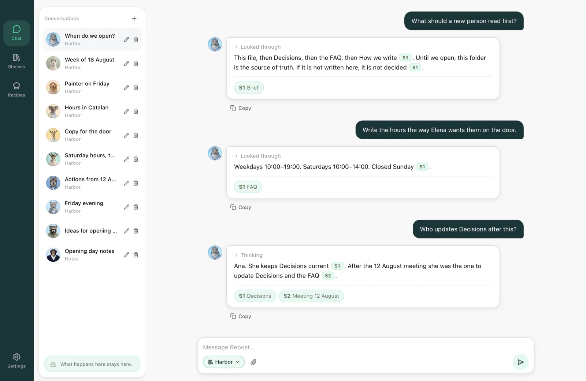
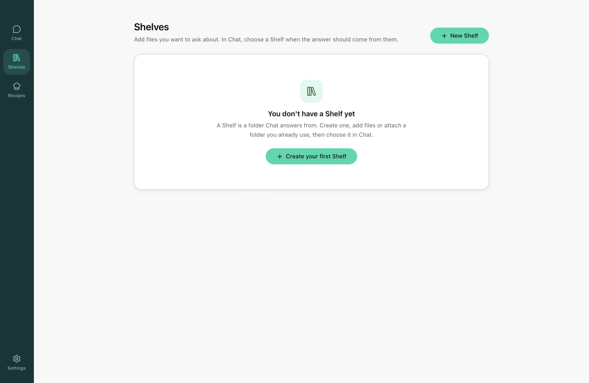
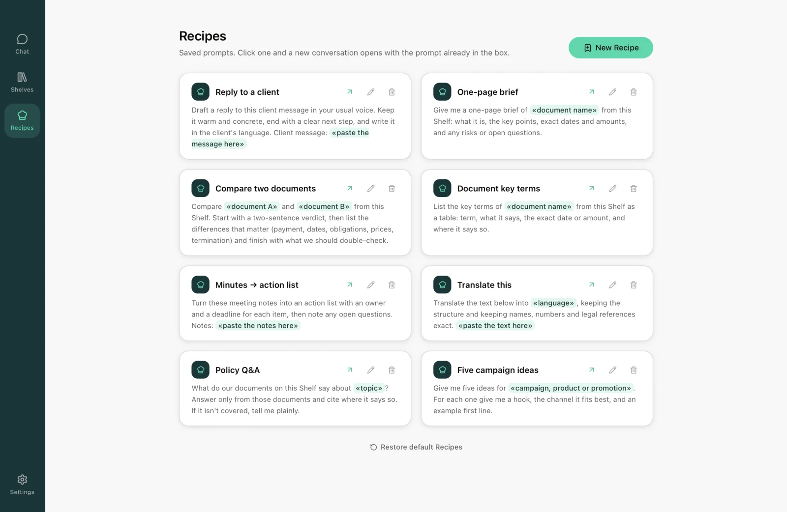
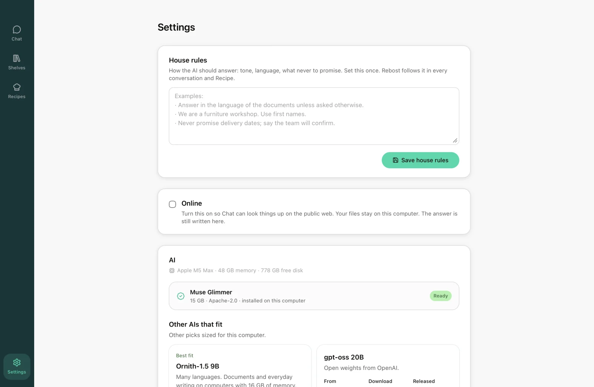

# Rebost

Private AI that works with your files. What happens on your computer stays on your computer.

<p align="center">
  
</p>

Rebost is a desktop application for Mac and Windows. It runs an AI on the machine where it is installed and answers questions about documents kept there. Questions go in Chat, the answer is generated locally, and each answer cites the files it drew on.

Documents reach the AI through a Shelf, a folder on the same machine that a conversation can be pointed at. Chat searches the selected Shelf, quotes what it finds, and links each citation back to the file it came from. There are two more ideas to know. A Recipe is a prompt saved for reuse, and House rules are standing instructions that apply to every conversation.

The first launch offers an AI sized for the machine's memory and downloads it. That file stays on disk, and every later answer is generated from it. The application is MIT licensed and free to use, and it works without an account. Rebost uses the network to find and install an AI and to check for a newer release. Documents on a Shelf are not uploaded, and web lookups are a setting that stays off until it is turned on.

[](https://github.com/Frontierz-AI/Rebost/actions/workflows/ci.yml)
[](LICENSE)
[](https://github.com/Frontierz-AI/Rebost/releases)

<p align="center">
  
</p>

## Download

The current release is **0.8.8**. Four installers are published on [GitHub Releases](https://github.com/Frontierz-AI/Rebost/releases), one per target, and the project site is [rebost.ai](https://rebost.ai/).

| Machine | Installer |
|---------|-----------|
| Mac with an Apple chip | Mac (Apple chip) |
| Intel Mac | Mac (Intel) |
| Windows 10/11 | Windows |
| Windows on ARM | Windows (ARM) |

The Mac download is a disk image: open it and drag Rebost into Applications. The Windows download is an installer.

Windows 11 already ships the component Rebost uses to draw its windows; on Windows 10 the installer adds [WebView2](https://developer.microsoft.com/en-us/microsoft-edge/webview2/) when it is missing. A regular Windows PC, meaning anything other than Windows on ARM, also needs a graphics driver with Vulkan support from NVIDIA, AMD, or Intel.

Once installed, Rebost checks GitHub for a newer release and shows it in the sidebar. Nothing is shown when that check fails.

## Chat, Shelves, Recipes, and House rules

### Chat

Chat is the main window. The installed AI answers each question there without the question leaving the machine. A file can be attached to a single conversation, either through the composer or by dropping it onto Chat; attachments belong to that conversation and do not become a Shelf. Picking a Shelf in the composer instead points the question at a whole folder. Answers that used a file carry a citation, and opening the citation opens the source.

<p align="center">
  
</p>

### Shelves

A Shelf is how a folder becomes available to Chat. Creating a Shelf and linking a folder, or dropping files into it, is what lets Rebost read those documents and search them later. Linking does not move or copy the folder, and renaming a Shelf inside Rebost leaves the folder on disk untouched. How thoroughly Chat searches is configured per Shelf.

<p align="center">
  
</p>

### Recipes

A Recipe is a prompt saved once and reopened later against any Shelf. Opening one starts a new conversation with that prompt already in the composer, so a request that comes up every week does not have to be typed again. A saved Recipe can still be edited.

<p align="center">
  
</p>

### House rules

House rules are standing instructions kept in Settings: tone, language, and anything the AI should never promise. They are written once and applied to every conversation and every Recipe. Settings also holds Online, which allows Chat to look things up on the public web. Online is off until it is turned on, and turning it on does not send Shelf documents to the web.

<p align="center">
  
</p>

Settings opens from the menu, or with ⌘, on a Mac and Ctrl+, on Windows. Explore other AIs is in the same window for cases where the suggested AI is not the right one.

## Getting started

A first session usually runs in this order.

1. Install Rebost from the release that matches the machine.
2. Install the AI offered on first launch, or skip it and install one later from Settings. Rebost refuses an AI the machine cannot run.
3. Create a Shelf, then link a folder or drop files into it. Rebost reads those documents so Chat can search them.
4. In Chat, select that Shelf and ask. Citations on the answer open the source file.
5. Save recurring requests as Recipes, and write House rules once for a consistent tone.

The first message after launch waits while the AI is loaded into memory. Later messages in the same session do not.

A team works the same way, one install per person. Each person runs Rebost on their own machine and points a Shelf at the folder the team already shares, which leaves no server in the middle. [docs/team.md](docs/team.md) covers that setup.

## Questions

**Is it free?** Yes. Rebost is MIT licensed and free to use. There is no paid tier, no seat count, and no usage meter.

**Is an account required?** No. There is nothing to sign up for and no one to sign in as. The first launch sets up an AI, and Chat works from then on.

**Do documents leave the machine?** Documents on a Shelf stay on the machine that holds them. Rebost uses the network to find or install an AI and to check for a newer release. The public web is reached only when Online is turned on in Settings, and that setting does not upload Shelf documents.

**Which AI does it run?** The first launch suggests one sized for the machine's memory and hides any that will not run on it. A different AI can be installed later from Settings. Each AI carries its own license, shown before the download starts.

**What hardware is needed?** A Mac with an Apple chip or an Intel processor, or a Windows 10/11 PC including Windows on ARM. Running an AI locally also needs several GB of free disk space for the download.

**Are phones or Linux supported?** No. Rebost is a desktop application for Mac and Windows.

**Can a team use it?** Yes, with one install per person and a Shelf pointed at a shared folder. There is no Rebost account and nothing to administer. See [how a small team uses Rebost](docs/team.md).

## Privacy

Documents on a Shelf stay on the machine that holds them, and reading, searching, and answering all happen there. Counts of personal information are counts, not a legal opinion.

Rebost does reach the network in a few places. Searching for or installing an AI contacts Hugging Face or Ollama, startup may check GitHub for a newer release, and on some Windows PCs the first chat downloads a faster way to run the AI. Online, in Settings, allows Chat to look things up on the public web and is off until it is turned on. [docs/privacy.md](docs/privacy.md) lists every request.

The application is MIT licensed. An installed AI carries its own license, shown before the download starts: [docs/licensing.md](docs/licensing.md).

Anything that looks like local files leaking belongs in [SECURITY.md](SECURITY.md) rather than a public issue. Other bugs go to [GitHub issues](https://github.com/Frontierz-AI/Rebost/issues), and a chat stuck while the AI loads is covered in [docs/troubleshooting.md](docs/troubleshooting.md).

## Develop

### Requirements

- macOS (Apple Silicon or Intel), or Windows 10/11 (x64 with Vulkan, or ARM64). Linux is not a supported platform.
- Disk space for a GGUF model (several GB)
- Rust 1.97.1, Node 22+, pnpm 11 (`rust-toolchain.toml` and `.nvmrc`)
- macOS: Xcode Command Line Tools
- Windows: MSVC toolchain. Windows 11 includes WebView2. On Windows 10, install the [Evergreen WebView2 Runtime](https://developer.microsoft.com/en-us/microsoft-edge/webview2/) before `pnpm tauri dev`. The NSIS installer downloads it when it is missing.
- First OCR build: CMake and a C++ compiler (xberg compiles Tesseract)

### Run locally

```bash
pnpm install
pnpm tauri dev
```

`pnpm tauri dev` without a prior `pnpm fetch-engine` downloads the pinned llama.cpp archive on first chat. Run `pnpm fetch-engine` once so first chat can stay offline.

### Checks and installers

```bash
pnpm check                         # svelte-check
pnpm format:check
cargo test --manifest-path src-tauri/Cargo.toml
pnpm test                          # Vitest
pnpm tauri build                   # unsigned DMG / NSIS
```

`pnpm tauri build` writes a DMG under `src-tauri/target/release/bundle/dmg/` (Apple Silicon or Intel, matching the build host unless `--target` is passed), or an NSIS installer under `src-tauri/target/release/bundle/nsis/`. Without signing credentials the installer is unsigned, and Gatekeeper will warn on macOS. See [docs/signing.md](docs/signing.md).

`./scripts/reset.sh` (macOS) or `./scripts/reset.ps1` (Windows) returns the app to first-run state, keeping Shelf folders on disk. Settings → Reset Rebost does the same from the running app. `cargo run --manifest-path src-tauri/Cargo.toml --example seed` loads demo data.

Contributing, commands, and architecture: [CONTRIBUTING.md](CONTRIBUTING.md), [docs/development.md](docs/development.md), [docs/releasing.md](docs/releasing.md), [docs/architecture.md](docs/architecture.md), [docs/engine.md](docs/engine.md).

## Docs

- [docs/faq.md](docs/faq.md): frequently asked questions
- [docs/team.md](docs/team.md): how a small team uses Rebost
- [docs/accessibility.md](docs/accessibility.md): keyboard and VoiceOver notes
- [docs/ui.md](docs/ui.md): colors, buttons, and other UI tokens
- [THIRD-PARTY-NOTICES.md](THIRD-PARTY-NOTICES.md): bundled software notices

## License

[MIT](LICENSE). Trademark: [docs/branding.md](docs/branding.md).
